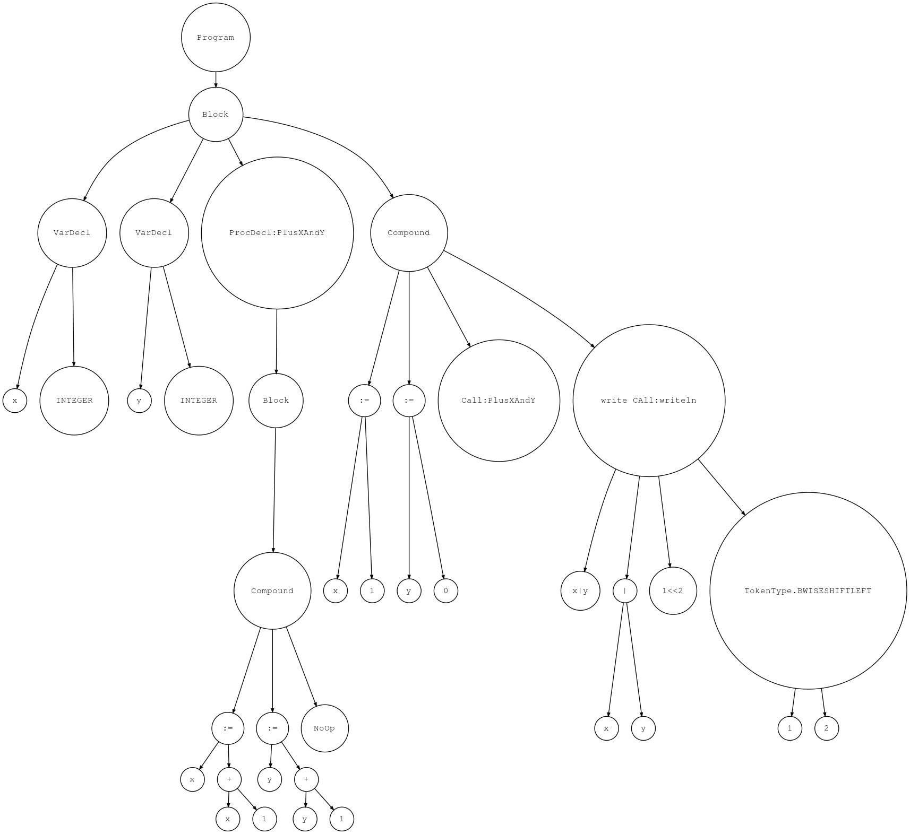

# DenkInterpreter

Interpreter Made for Pascal Like Language in Python. Ships with text editor ironically made in java.
[DenkInterpreter on github](https://github.com/Kaushal1011/DenkInterpreter)

## Collaborators

- [Kaushal Patil](https://github.com/Kaushal1011)
- [Dhruvil Dave](https://github.com/dhruvildave)

## DenkInterpreter CLI

___for support on langugae see DENK.md/DENK.pdf___

### requirements

- Python3
- Java min JDK8,optimun JDK 11 [For DenkEditor(GUI)]

___for instruction on running Denk Interpreter text editor see READMEGUI.md/READMEGUI.pdf___

### How to run InterpreterCLI

To run on any of the test

- Linux

```shell
python3 interpreter.py test-10.pas
```

- Windows (with python installed as python3)

```shell
python interpreter.py test-10.pas
```

To see call stack

- Linux

```shell
python3 interpreter.py test-10.pas  --stack
```

- Windows (with python installed as python3)

```shell
python interpreter.py test-10.pas --stack
```

About tests:

- test-1 : to check basic working of math abilities language
- test-2 : to check basic defining of procedures in language
- test-3 : to check calling of procedures in language
- test-4 : to check nested procedures
- test-5 : checks boolean operations and datatype
- test-6 : to check conditionals of the lanaguage
- test-7 : to check looping construct of the language
- test-8 : to check input abilities of language
- test-9 : to check string support in the language
- test-10 : to check bitwise operator support of the language
- test-function : to check function declration and calling in langauge
- test-error-1 : to check error handling abilities of langauge

executed test results are saved in testresults directory

To create the ast of the program (using graphviz library) run:

- Linux

```shell
python3 visualise.py test-10.pas > test-10.dot && dot -Tpng -o test-10.png test-10.dot
```

- Windows (with pyhton installed as python3)

```shell
python visualise.py test-10.pas > test-10.dot && dot -Tpng -o test-10.png test-10.dot
```

example code that gives an idea about the language

```pascal
program Main;
    var x, y : integer;
    procedure PlusXAndY();
        procedure PlusYAndX(a: integer; b: integer);
        begin
            x := x + a;
            y := y + b;
        end;
    begin
        x := x + 1;
        y := y + 1;
        PlusYAndX(2,3);
    end;
    function PlusBy1(a: integer): integer;
    begin
        PlusBy1 := a + 1;
    end;
begin { Main }
    x := 1;
    y := 0;
    PlusXAndY();
    x := PlusBy1(x);
    var a;
    var b;
    var b2;
    var c;
    a := 0;
    b := 0;
    b2 := 0;
    c := 1;
    while a < 10 do
    begin
        a := a + 1;
        while (b < 20) and (b >= 0) do
        begin
            b := b + 1;
            if (b > 10) then
                continue;
            b2 := b2 + 1;
        end;
        while (c < 30) and (c > 0) do
        begin
            if c >= 15 then
                break;
            c := c + 1;
        end;
    end;
    var x;
    var y;
    var z;
    var x=a|b;
    var y=~b2;
    var z=c<<2;

    writeln('x=',x,'y=',y,'z=',z);
end.  { Main }
```

example image of tree

