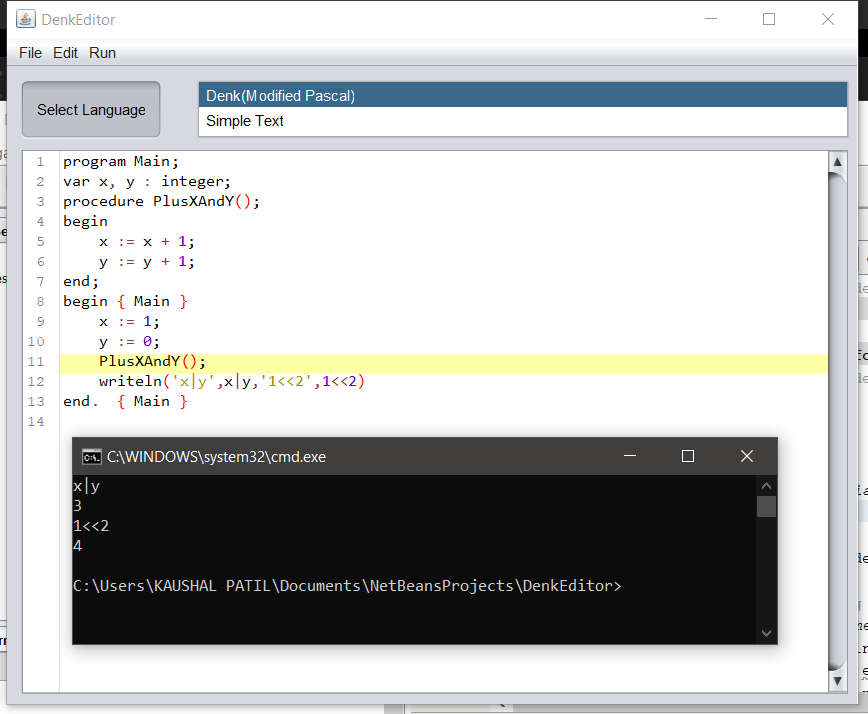

# DENK TEXT EDITOR (GUI)

Files present in DenkEditor directory

## Limitations

- editor will run from netbeans only as of now
- works only in windows as run uses cmd
- run may give error sometimes due to relative paths being used
- requires java to run gui and python to run interpreter of language

## To run

Open DenkEditor in Netbeans
run LightIde.java

## How to use

- one the editor is open
- select language denk and click on button select
- write code yourself or open any of the tests
- for example open test-10
- click on run in cmd in run tab in the top toolbar
- explore other functionalites of editor
- syntax highlighting is for c as of now coming soon for denk

example use case and output (keep scrolling)

